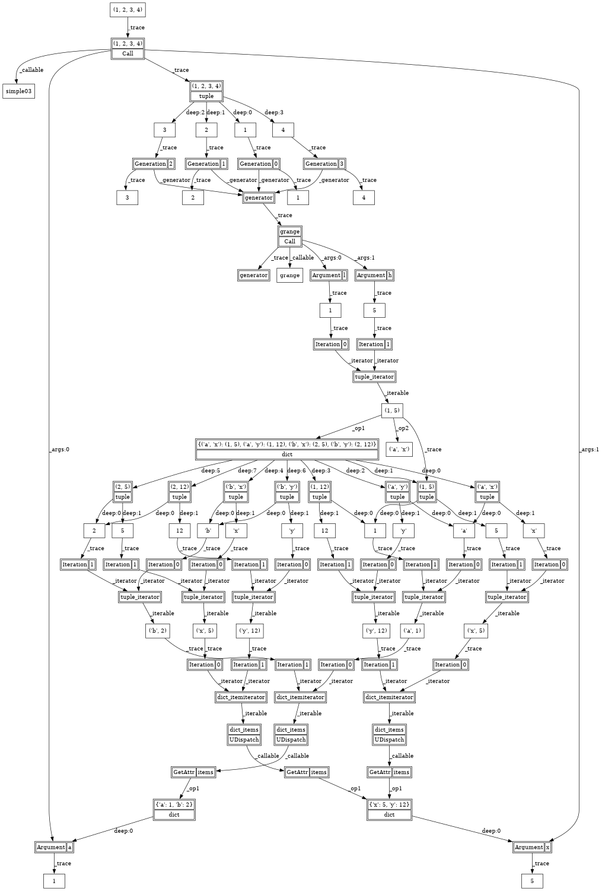

# hltpy: high-level tracing python  

A generic high-level tracing library for Python. 
A library to dymacially wrap chosen data, objects, class and modules, 
for the purpose of producing an execution trace. The execution trace 
can then be processed, for example with the purpose of enabling advanced 
JIT interpretation of an embedded DSL.

## Status
This first draft 0.1 (July 2025). It does enough that I can use it for combine inference of
units and types, but still has a few big gaps, such as not allowing 
traced operations to be processed during tracing. Also slices are not yet traced.

## Introduction
hltpy is a high-level tracing Python library. It loosely is inspired by
JAX, PyTorch tracing, Sympy, existing automatic differentiation code, which share
the approach of dynamic capturing of Python objects dispatches for the purpose 
of dynamically providing advanced features and without burdening the developer. 
In effect, all, or a selected subset of, operations are intercepted. For example, additions expressed 
with a '+' symbol result in the \_\_add\_\_ operation being intercepted. 
Tracing is then the act of remembering these operation interceptions. 
Tracing at a low level is common, for exmple, Pyton's trace library. 
Tracing at high-level captures both the history and the structure of execution. 
High level tracing captures as much the source code level of the language as possible.

The purpose of the hltpy library is support embedded DSL languages by facilitating the development of
structural and type inference, abstract interpretation, and high-order, distributed, trustful,
and reversible interpretation semantics. 

## hltpy basic features
The Traced class dynamically wraps all traced Python data and captures 
all operations on this data. The base class Traced has no knowledge of the
data it is tracing (and held in the \_value attribute). Derived from Traced 
are classes that implicitly capture the context of the operation that produced
the traced data. These derived classes are: Tuple, Obj, Function, Class, 
Call, Dispatch, UCall, UDispatch, NewInit, GetItem, GetAttr, Argument, SetAttr.
In this version 0.1, the Traced and derived classes are typically 
not directly used during the tracing processing by the developer. From the 
developer's perspective, the tracing is controlled through the functions: 
trace\_modules, trace, and from\_traced. 

## How it works
- trace\_modules will place hooks to trace all class definitions and top-level 
functions of the provided module names. 
- All operations of traced objects are intercepted, including traced classes. 
- Instantiation of new objects through traced classes automatically traces 
(wraps) the newly instantiated objects of that class.
- Operation interception creates new traces. 
   - For example, if x is traced, then 
x\.f(y) will produce Call(GetAttr(Attribute('x'), x), [Argument('...', y)], {}).
- Each 'tracing' object also carries the original python computation in their
\_value field.

What to know:

- Nothing is optimized. The current usage target is depth of interpretation, not speed.  
- Type conversation operations such as \_\_float\_\_ are not traced. (Not clear yet if this is a good idea!)
- Arguments to calls on traced methods/functions are all traced, if 
the module traced!
- No tracing happens to calls to methods/functions in untraced modules. More
importantly, any traced objects and method/function arguments are "untraced"
before calls are done!
- \_\_setattr\_\_ allowed in \_\_init\_\_, but not elsewhere as we follow an immutable style of programming.

## Example trace re-evaluation and constraint analysis
The Evaluator class is a draft example how the traced data can be (re-) evaluated.
The BuildUpstreamConstraints is a minimilistic example of how the traced data
can be used to extract the 'reverse' flow constraints needed for structure or 
type inference.   

## Exmple expression graph visualization:
The Render class is a draft of converting a trace to a graphviz graph.
[show_render.py](./show_render.py) take a decently simple trace of a 
object that adds some number, and produces the following:

 

## Some public prior work
[autograd](https://github.com/HIPS/autograd)
[JAX JIT](https://research.google/pubs/compiling-machine-learning-programs-via-high-level-tracing/)
[PyTorch tracing](https://docs.pytorch.org/docs/1.9.0/jit.html)
[Sympy](https://www.sympy.org/en/index.html)
[Python trace](https://docs.python.org/3/library/trace.html)

## Note on ML usage in coding
I asked Gemini to draft me a first concept 
([see here](https://equational.blogspot.com/2025/06/master-class-techniques-for-llm.html) 
for how to do high-level design with an LLM). Unformtunately there was so much missing in that first version
that I rewrote it and that is what you have here. (Note that the blog presents a much more rosy picture. Yet there
is a difference between prototype and code on which you build).

_All original content copyright James Litsios, 2025._
